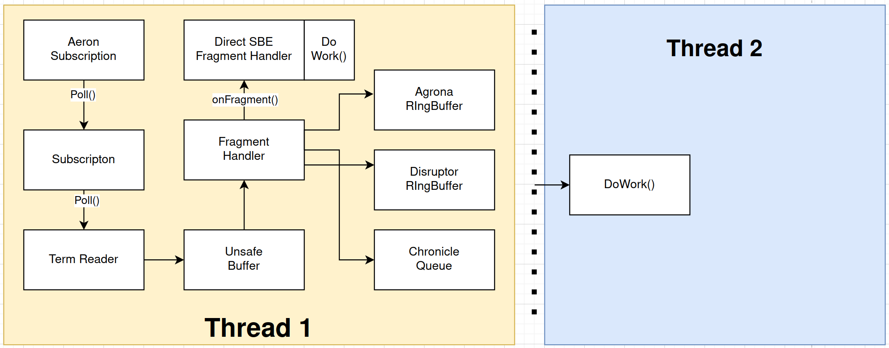

# marketdata-messages
Project using SBE, Aeron, Agrona ringbuffers, Disruptor, Chronicle Queue, Likwid markers, code generation

**Very High Level**
Generate messages using SBE, send and recieve them using Aeron, put those messages onto ringbuffers or queues so you can do stuff with them.

**High Level**
This project demonstrates the use of code generation in combination with Aeron, SBE, Agrona ringbuffers, Disruptor ringbuffers, Chronicle queue, Junit tests, JMH benchmarks and Likwid markers. 

I initially wanted to profile the distribution of different kinds of market data updates and see by how much a message specification that was designed from those data insights would outperform a naive one on real life non-homogenous workloads. 

- [Problems with UDP and Message Rates](#Problems with UDP and Message Rates)
- [Interfacing Aeron to Existing Message Processing Paradigms](#Interfacing Aeron to Existing Message Processing Paradigms)
- [Benchmarking and Performance Testing](#Benchmarking and Performance Testing)
- [Use of Autogenerated code](#Use of Autogenerated code)
- [How Do I Run This?](#How Do I Run This?)
- [Common Pitfalls](#Common Pitfalls)
- [Package Summary and Unit Tests](#Package Summary)
- [FAQ](#FAQ)

**Problems with UDP and Message Rates**
One of the main problems with reliable UDP based messaging is that of slow consumers. Slow consumption leads to backpressure and can cause UDP storms. 

In the Aeron media driver you have a plethora of ways of dealing with high message rates, slow consumers etc including inbuilt flow control and optimising the term buffer sizes. This can help smooth out the negative behaviour of slow consumers.

Still reading?

**Interfacing Aeron to Existing Message Processing Paradigms**
This project looks at different ways of interacting with Aeron and interfacing it to existing paradigms for dealing with high data rates and message processing - namely the Disruptor, Chronicle Queue and the Agrona ManyToOneRingBuffer. 

 

This is composed of a set of adaptors that are FragmentHandler implementations which publish onto those various paradigms. These are mostly in com.bht.md.rbpublishers

This provides a way of publishing SBE messages over Aeron to existing systems which use ringbuffers or queues. It also provides some backpressure management - you can use these ringbuffer or queue structures to reduce the backpressure responsibility on Aeron - we are basically doing the backpressure shuffle. 

Why do we need to do this? Because that's real life, sometimes we need to use adaptors to connect things to the existing way of doing things, or add a little buffering here and there. It could also be because we don't want to tune the Aeron media driver for a specific use case, but for the general use case on a single machine (different services, consuming at different rates).

In these adaptors, the decoding of the SBE message is handled in a paradigm specific way i.e. by processing the ringbuffer or processing the queue, so the decode of the SBE message happens on a different thread to the Aeron subscription. This inevitably involves a memory copy at some point, but that's the point. These are mostly in com.bht.md.rbhandlers

The project also allows comparing these existing paradigms with handling being done directly on the Aeron subscriber thread via a FragmentHandler implementation i.e. we leave backpressure and slow consumer handling directly to Aeron. In this example the decoding of SBE messages is done in the FragmentHandler implementation. This is in com.bht.md.handlers.AeronSBEDecodingFragmentHandler

The SBE messages are generated using the sbe-all.jar from an XML config in the standard SBE format. A variety of messages are created to simulate different styles of market data, with and without repeating groups.

**Benchmarking and Performance Testing**
For each of the paradigms, there is a PerfTestSubscriber* with a main() method that you need to run which will decode the SBE message and then echo it back to the publisher. 

The RTPerfTestPublisher publishes encoded messages to an Aeron publication (exclusive and non-exclusive) and in the same thread it processes the subscription on which it is expecting the echoed back message. 

This echoed back message contains the sending timestamp in nanoseconds which is used to calculate a time delta from sending and recieving on the same thread. This delta is fed into a MessageBasedRTHistogramRecorder which decodes the message, calculates the delta and puts it into various HDRHistograms based on the message type (the SBE TID), which are subsequently persisted.

**Use of Autogenerated code**
The classes that generates the following code are not included in the project :

* The abstract handler which does the delegation of the decoded SBE messages (which you can implement to do whatever logic you want based on the messages). There is also a generated "marked" version of this class, which uses Likwid markers to mark each region of business logic and includes the decode time of the SBE message

* There are a set of *EncodeHelpers for each message class which can help you encode the SBE message in the correct order.

* Unit test scaffolding for each type of message is also generated, enforcing 3 types of encoder unit tests: standard constant values, random values and extreme values. Tests are all tagged based on the type of test and the encoder name.

* JMH benchmark scaffolding is generated for each message type.

Whilst the autogenerated code is not perfect, it can save a lot of development time and also enforce development processes. The code generation leaves a project in a state with a bunch of TODOs which the developer can see and implement. These are mostly unit test implementations and encoding of fields which the autogenerator is not sure about. With some more work, the generation of most of the unit tests and JMH benchmarks could also be handled. 

Some of the issues with using autogenerated code in this fashion are use of reserved words in your message spec as well as potentially reinforcing any mistake made by an encode helper e.g. an encode helper makes certain assumptions about how to encode an object and the unit test inadvertently makes the same set of assumptions.

This means it is still important for a developer to be concious in their due diligence, testing and validation and not to gain a false sense of security. It also helps if you can enforce certain things in your SBE message spec through your design process. 

**How Do I Run This?**

1. Start an out of process media driver - see MediaDriver class in aeron-driver or MediaDriverVariationsLauncher in the utils folder
2. Start one of the PerfTestSubscriber* located in the samples folder
3. Start the RTPerfTestPublisher located in the samples/roundtrip folder

When everything is working you should see an output which gives you the mean and median values for the roundtrip by TID. A bunch of histogram files will also be generated periodically so you can track the distribution over time. 

There are also a set of runners in the samples/clean package which is a refactoring of the test runners, these are setup
to record test details to a Chronicle Queue.

**Common Pitfalls**

Please check the following if you have problems with the samples:

1. Check your channel and stream ids match
2. Check whether you're using an embedded media driver or an external one
3. If you've implemented a SBEDecodingHandler or extended the AbstractSBEDecodingHandler then check your implementation of isValid()
4. Try running Aeronstat to examine the cnc file
5. Try reducing some of the logging figures in the MessageBasedRTHistogramRecorder, depending on your hardware and choice of message processing paradigm you may not see output for a while
6. Try changing the maxbuckets param in MessageBasedRTHistogramRecorder as your latency may be too high

**Package Summary**

aeron - wrappers to do publication and subscription
handlers - classes which do SBE decoding
messages - autogenerated from the SBE message spec using the sbe-all jar
messages.encodehelpers - autogenerated using my own tool
messages.sendhelpers - autogenerated using my own tool
perfmeta - implementations of the PerformanceMetaManager for persisting performance data. Includes implementations of Chronicle Bytes Marshallables
rbhandlers - classes that process the data being published on different paradigms, includes Identifiable handlers for Agrona which allow for direct stream and session identification
rbpublishers - mostly FragmentHandlers that publish onto different paradigms
ringbuffers - a modified version of an Agrona ringbuffer for Identifiable session and stream info
samples - runners for various tests
samples.clean - refactored runners
samples.roundtrip - roundtrip publisher of different message types
util - utils for launching Media Driver with affinity, some thread and idle strategy utils

test/java/

bht.md.messages - autogenerated unit test code using my own tool
bhf.encodervalidation - discussions and examples of how to test and validate encoders
bhf.fieldvalidation - discussions and examples of how to test and validate fields
bhf.multiversion - discussion and example of how to handle multiple versions of message specs

**FAQ**

Q. "You didn't even implement x or use feature y!" OR "Why don't you implement more features?" OR "Can you open source the code generation as well?"
A. I am not trying to start a new open source project, I've published this code as an example of what I can do, so there are some compromises I've had to make.

Q. Did you know there is a transitive dependency conflict for slfj?
A. Yes, I may fix this at a later stage by removing Chronicle Queue or splitting this project up into smaller components.

Q. Did you know that there were was already an implementation for your *Utility?
A. I probably only found that out or remembered later on in the process, so left them there for now as I was probably already using them someplace. I may fix this with delegation or simply refactor and use existing solutions/classes.

**Please Note**

If you think someone like me can add value too your team, I am currently looking for a new role.

If you've read this far and are still interested, then you can check out the stages.txt which is a more in depth breakdown of the different stages of the project, offers some insight into how I managed my time and refocused my efforts, and gives some insight into my findings. It is partly retrospective and partly real-time notes.

